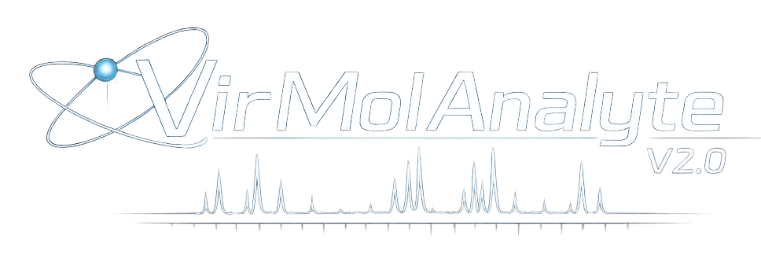
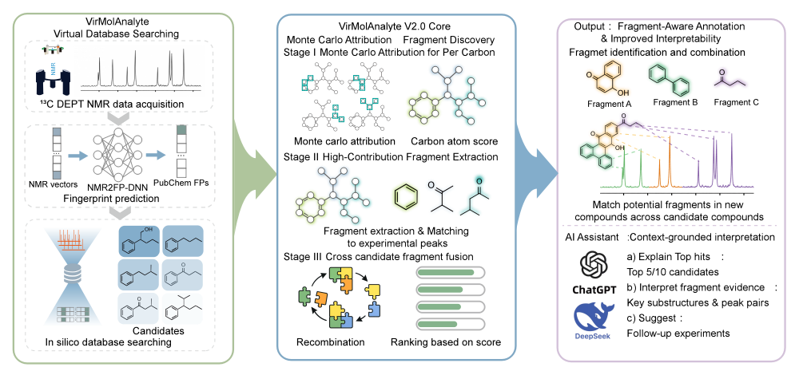
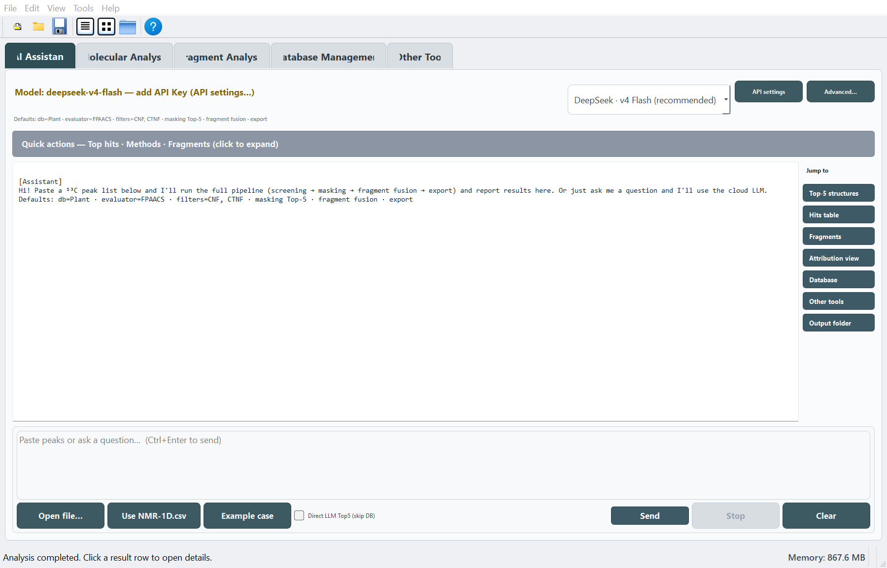
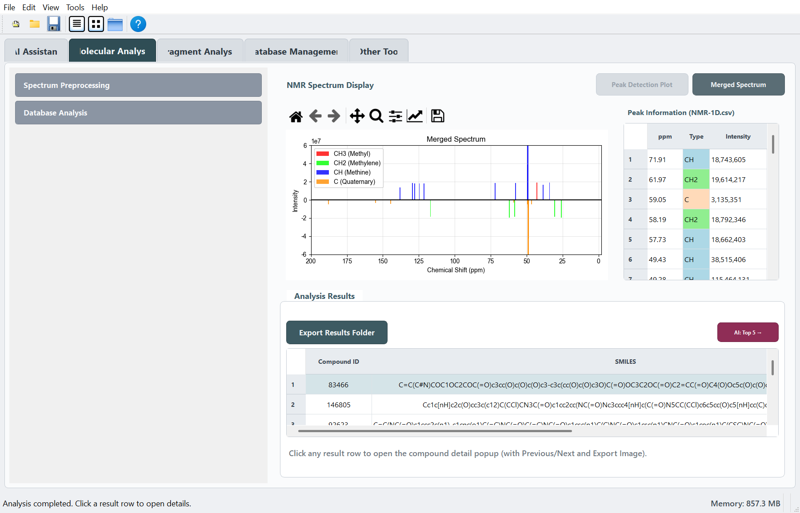
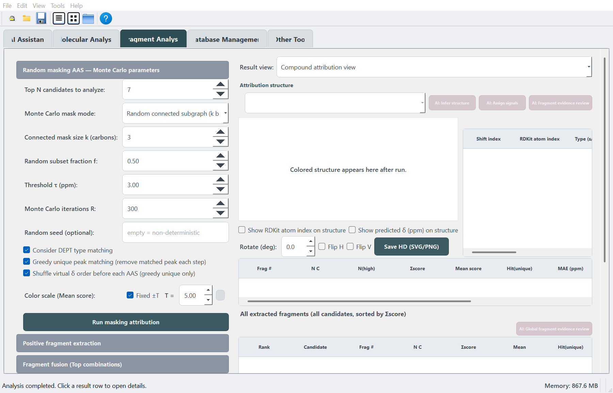
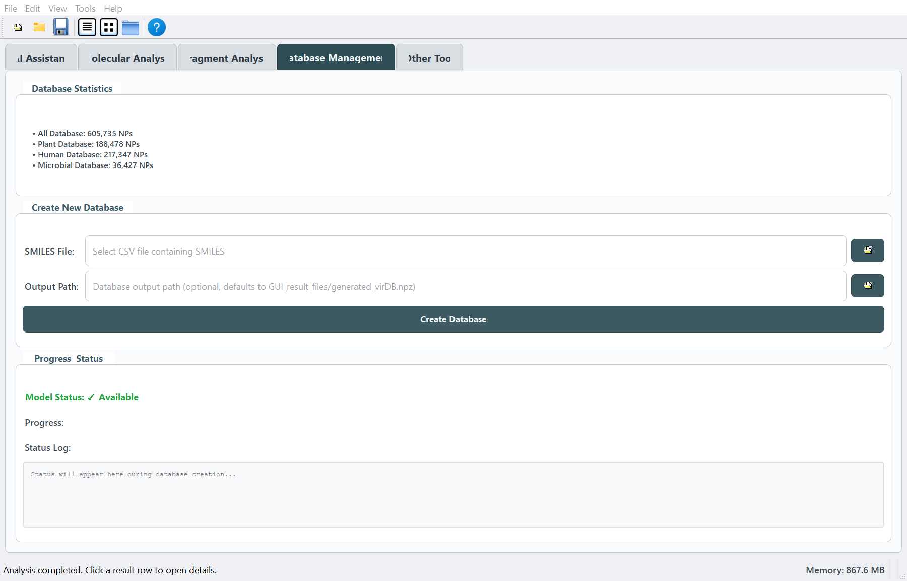
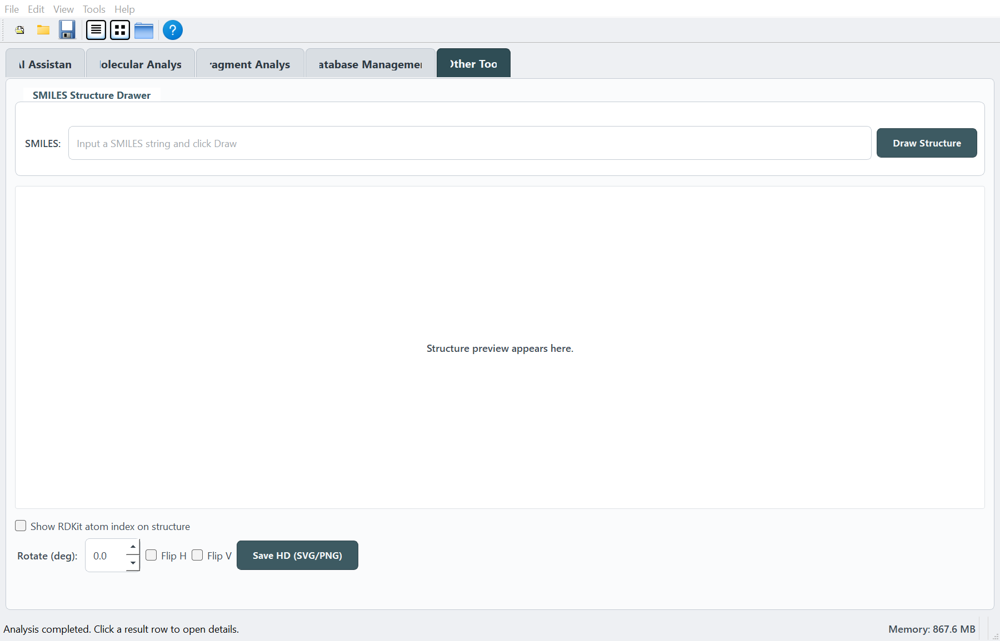

# VirMolAnalyte V2.0

<p align="center">
  
</p>

**VirMolAnalyte V2.0** is a desktop workflow for 1D NMR-guided natural product
annotation. It combines Bruker 13C/DEPT preprocessing, in silico natural
product database screening, masking AAS fragment attribution, and optional
AI-assisted interpretation in a PyQt5 graphical interface.

Developed by the research team at the **Kunming Institute of Botany, Chinese
Academy of Sciences**. Released under the **MIT License**.



## Highlights

- **13C/DEPT preprocessing**: load Bruker `pdata/1` folders, detect peaks,
  merge 13C / DEPT90 / DEPT135 signals, and remove solvent or impurity peaks.
- **Database screening**: search built-in or custom `.npz` molecular libraries
  with CNF, CTNF, MW filters and CSS, AAS, FPS, or FPAACS scoring.
- **Fragment attribution**: run random masking AAS, extract positive fragments,
  map fragment-to-peak evidence, and perform fragment fusion analysis.
- **AI Assistant**: run workflow checks, use offline diagnostic tools, and
  optionally call a configured LLM for Top-N, signal, fragment, and report
  interpretation.
- **Publication-oriented output**: export result tables, peak lists,
  publication-quality structure images, methods text, and analysis summaries.

## Interface

### AI Assistant



The AI Assistant provides guided screening, preflight checks, offline tools,
and optional LLM-assisted interpretation.

### Molecular Analysis



The Molecular Analysis tab handles spectral preprocessing, manual peak input,
database loading, candidate ranking, compound detail views, and result export.

### Fragment Analysis



The Fragment Analysis tab adds masking AAS attribution, positive fragment
extraction, fragment-to-spectrum mapping, fusion analysis, and high-resolution
structure export.

### Database Management



The Database Management tab builds custom `.npz` databases from SMILES files
for downstream molecular screening.

### Other Tool



The Other Tool tab draws standalone SMILES structures and exports HD SVG/PNG
figures.

## Quick Start

### Option A: From Bruker raw 1D data

1. Open **Molecular Analysis**.
2. Set `13C_NMR`, `DEPT90`, and `DEPT135` folders, usually `.../pdata/1`.
3. Click **Submit** for peak detection.
4. Click **Merge** to create `GUI_result_files/NMR-1D.csv`.
5. Click **Load Database** or **Load Other Database**.
6. Select filters and evaluator, then click **Start Analysis**.
7. Review **Analysis Results** and open **Compound Details**.
8. Optional: open **Fragment Analysis** for masking attribution and fragment
   evidence.

### Option B: From a prepared peak list

1. Open **Molecular Analysis**.
2. Paste peaks into **Manual peak input** using one line per signal:

   ```text
   131.2, s
   116.3, d
   36.8, t
   27.1, q
   ```

3. Click **Load Database**.
4. Click **Start Analysis**.
5. Continue to **Fragment Analysis** or **AI Assistant** if needed.

### Option C: AI-guided workflow

1. Open **AI Assistant**.
2. Load a peak file, use `NMR-1D.csv`, paste peaks, or load the example case.
3. Run the guided workflow.
4. Review generated results in **Molecular Analysis** and downstream modules.

## Repository Layout

```text
VirMolAnalyte/
  virmol_gui.py              # Main PyQt5 desktop GUI
  virmol_ai/                 # AI assistant helpers and LLM integration
  VirMolAnalyte/             # Core database, NMR, and scoring modules
  NMR2FP/                    # NMR-to-fingerprint model resources
  Database/                  # Built-in or local molecular database files
  test/                      # Example data
  website/                   # MkDocs documentation website
  Figures/                   # README figures
```

## Documentation

The user guide is maintained under `website/` and can be built with:

```bash
cd website
python docs.py build
```

After building, open:

```text
website/site/index.html
```

The documentation includes module pages, Quick Start videos, dynamic web tool
instructions, and GUI screenshots.

## Citation

VirMolAnalyte V1.0 was introduced in:

> Guilin Hu, Jameel Hizam Alaffff, and Minghua Qiu.  
> **VirMolAnalyte: An AI-Driven In Silico Metabolite Annotation Tool.**  
> *Analytical Chemistry* **2025**, 97, 28181-28191.

## License

VirMolAnalyte V2.0 is released under the **MIT License**.

